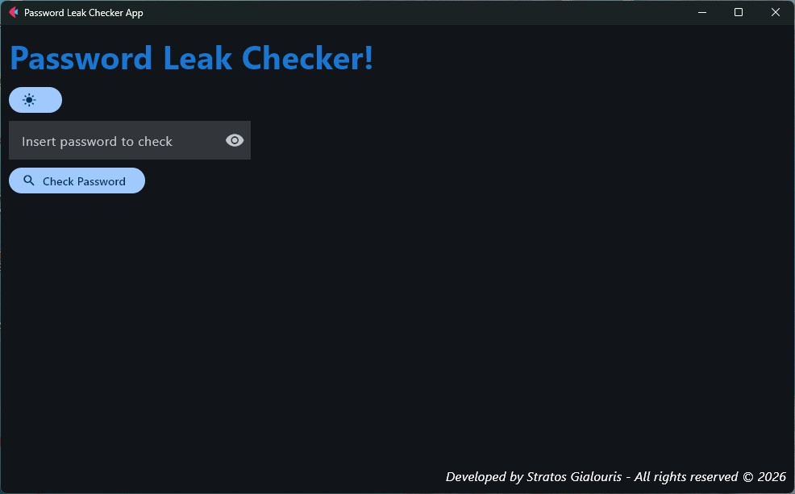
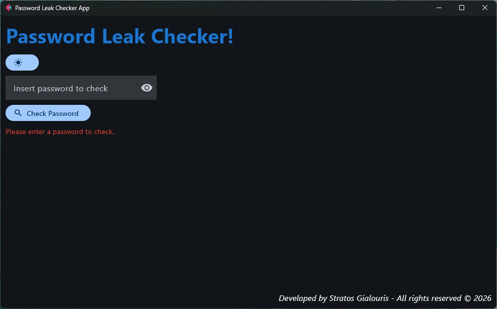
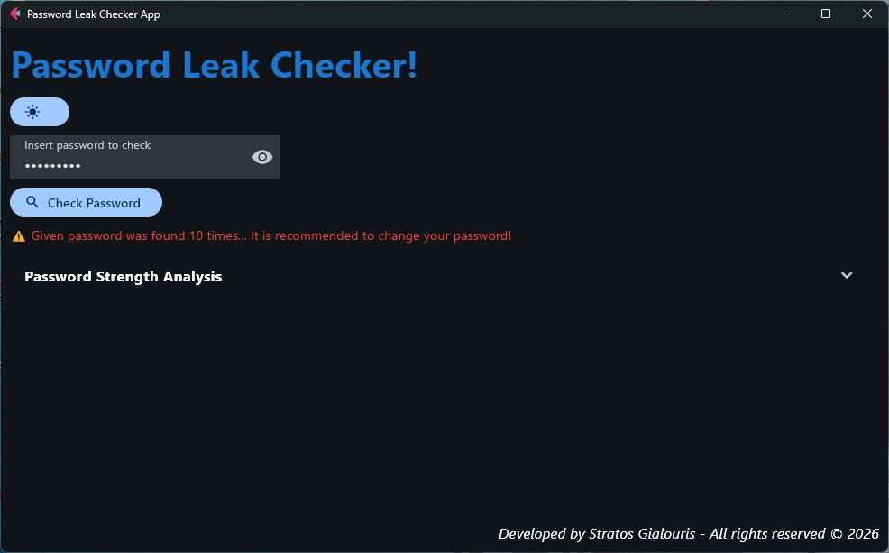
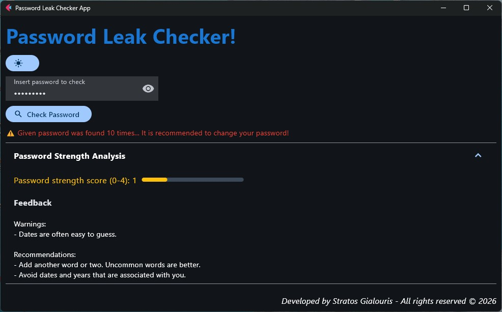
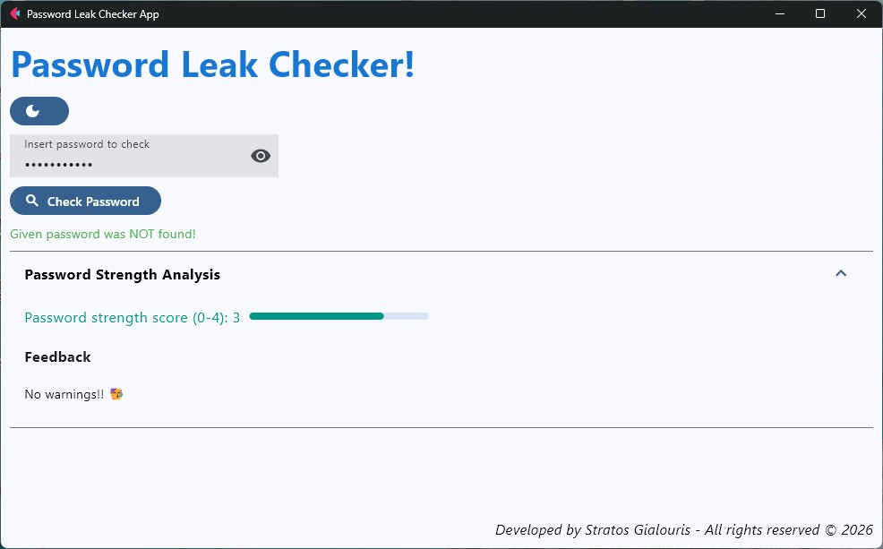
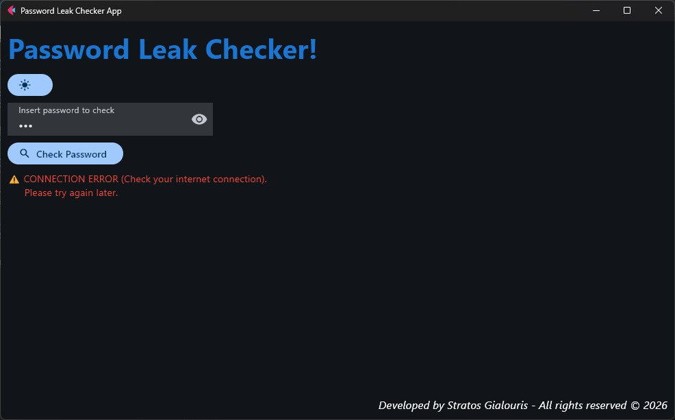

🛡️ Password Leak Checker & Strength Auditor

A professional desktop utility built with Python and Flet that provides a comprehensive security audit of any password without compromising user privacy.

🌟 Key Features
Privacy-First Leak Detection: Uses the HIBP Range API and SHA-1 hashing to check if a password has been compromised in a data breach.

Technical Note: Only the first 5 characters of the hash are sent to the server (K-Anonymity), ensuring your full password never leaves your local machine.

Heuristic Strength Analysis: Integrated with the zxcvbn library (developed by Dropbox) to provide realistic strength scores (0-4) based on pattern matching and entropy.

Actionable Feedback: Provides specific "Warnings" and "Recommendations" to help users improve their password complexity.

Modern UI/UX: * Dark/ Light Mode selection for a sleek, professional look.

Interactive Progress Bar that visually reflects password strength.

Visibility Toggle: An "Eye" icon to show/hide plain text during entry.

Resizable Layout: A resizable 1000x620 window to maintain UI integrity across different devices.

Error Handling: Measures are in place to protect the app from crashing due to an error, and an error message is displayed for the user.

🛠️ Technical Stack
GUI Framework: Flet (Flutter for Python)

API: Have I Been Pwned? Pwned Passwords API

Analysis Engine: zxcvbn

Networking: requests

🚀 Installation & Usage
Clone the repo:
git clone [your-repo-link]

Install dependencies:
pip install -r requirements.txt

Run the application:
python Password_leak_checker.py

